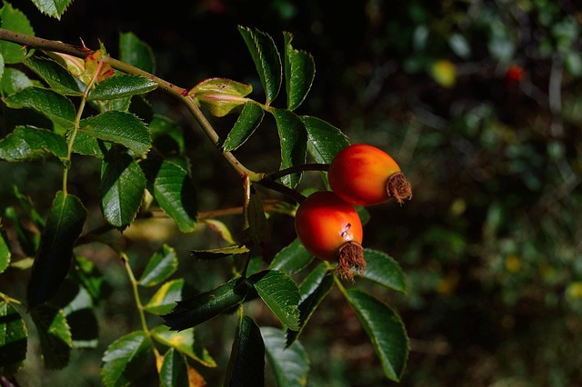

# Competitive programming golang environment with template

## Usage
1. Open The folder in vscode
2. Using remote container extension, select reopen in container
3. Install all tools suggested by vscode
4. Leave only the main (and optionally the solve) function related to your platform
4. Code!
    - Use io.Scan... and io.Print... (always add a newline at the end of a solve). P.s. If you are using Leetcode ignore this.
    - Use "log" to print while debugging

If you want to solve multiple problems simultanously (like in contests) just copy paste "problem" folder for each problem

## Assuntions
1. Every pointer receiver method assume that the pointer is not nil
2. All assumption (if any) are specified in each function
3. Numbers ovewflow errors are not covered

## Naming conventions different from standard:
1. For any function (not methods)/type/interface that can be directly be used in competition use uppercase, otherwise use lowercase

## Go docs
https://go101.org/article/type-system-overview.html

## How to contribute
1. Reporting a bug
2. Discussing the current state of the code
3. Submitting a fix
4. Proposing new features
5. Becoming a maintainer

## Future proposals
- Create a library/module called actually "goji" with all data structures and algorithms but for general use, so well organized in packages